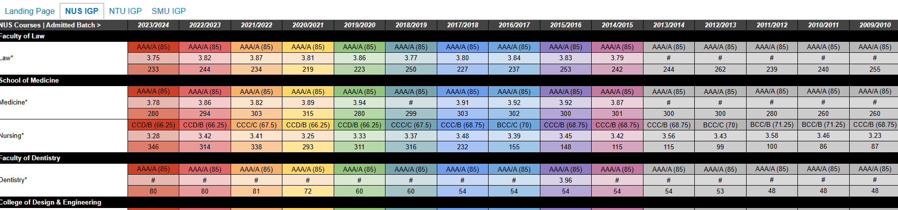

# Project-SG_Uni_cutoffs
Plotting the igps of the various courses in the big 3 unis in Singapore using matplotlib, and hopefully catching some interesting patterns and trends that we can look more into and attempt to justify.

The 'Images' folder is where all the images used in the README.md will be stored. 'myenv' is the virtual environment configurations, and uniscrape.py is the main project file code.

V1: After creating a virtual environment and activating it and creating a requirements.txt file which contains the necessary packages needed, i pip installed all the packages, then imported the packages into the newly created python file, uniscrape.py. I also defined the url variable for the website ill be scraping in the python file.

V2: Here i use requests to get the html of the website and pass it through beautifulsoup which formats the raw html text by adding indents and making it easier to examine. We can see that the info we want to get is mostly in the 'tbody' tag (Fig 1), so we define those tags as the variable 'content'. When i print(len(content)), i get 4, 1 for each section as u can see in Fig 2. But i dont care about the first Landing Page section, just the last 3 which contain information about NUS, NTU and SMU. So i get rid of the first 'tbody' tag. But inside the next 3 target tags are still a whole lot of html, so to not overload my screen with text i just print all the content in the first section, which contains info on NUS only.

Fig 1:

Fig 2:

